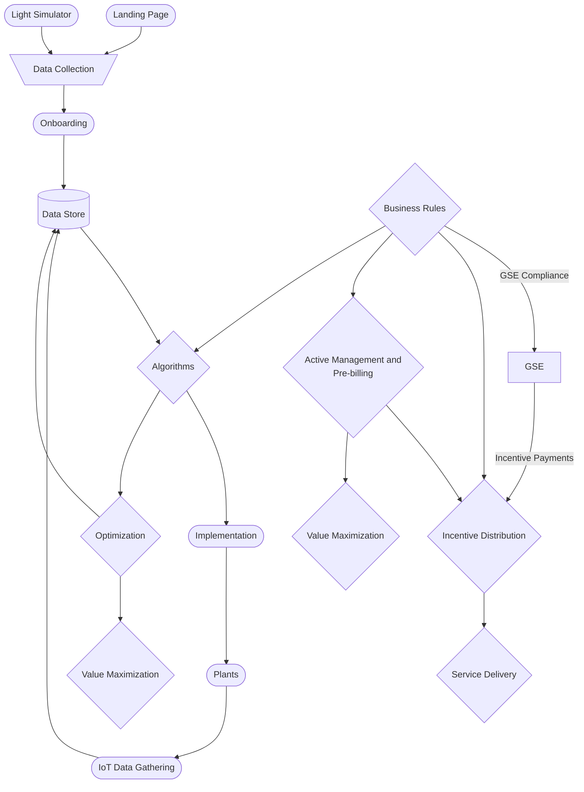

## Configuration of Renewable Energy Communities (REC) in Italy
## (Progettazione e Gestione delle Configurazioni delle CER)

### Executive Summary

This document provides a comprehensive technical specification for designing and implementing an application to manage Renewable Energy Communities (REC) configurations in Italy. It integrates official guidelines from GSE and ARERA, insights from platforms such as Hive Power FLEXO and Blumatica Impianti Solari, and academic research into a structured blueprint for REC management systems. The document covers configuration scope, data structures, organizational models, economic parameters, and UI design guidelines for an integrated platform that supports legal, operational, technical, and regulatory aspects of CERs.

### Introduction

Renewable Energy Communities (RECs) represent an innovative model in the Italian energy sector, enabling groups of consumers and energy producers to collaborate in generating and using renewable energy. A well-defined configuration establishes the legal, organizational, operational, and technical guidelines necessary for shared energy management while facilitating access to economic incentives and optimizing renewable energy production and consumption.

### 1. Configuration Scope and Objectives

#### 1.1 Primary Objectives
- **Legal Framework Definition**
  - Establish legal structure (association, cooperative, benefit corporation)
  - Define member rights and obligations
  - Implement governance structure
  - Manage membership procedures

- **Operational Organization**
  - Define internal governance
  - Establish decision-making processes
  - Assign roles (including GSE referent)
  - Manage daily resource allocation

- **Energy Resource Management**
  - Optimize production and consumption
  - Monitor shared energy metrics
  - Implement hourly data collection
  - Track performance KPIs

- **Regulatory Compliance**
  - Ensure alignment with national/EU regulations
  - Verify technical connection requirements
  - Monitor power limits compliance
  - Maintain ARERA compliance

- **Incentive Management**
  - Enable access to feed-in tariffs
  - Process capital contributions
  - Aggregate production/consumption data
  - Generate regulatory reports

### 2. Configuration Data Structure

#### 2.1 Community Profile
```typescript
interface CommunityProfile {
    cer_id: string;                // Unique community identifier
    name: string;                  // Official REC name
    legalForm: LegalEntityType;    // Cooperative, association, benefit corporation
    location: {
        coordinates: GeoCoordinates;
        primarySubstation: string;  // GSE substation identifier
        validationStatus: boolean;
    };
    registrationDate: Date;
    status: 'active' | 'pending' | 'suspended';
    complianceInfo: {
        gseRegistration: string;
        areraCertification: string;
        lastAuditDate: Date;
    };
}

interface MembershipData {
    memberId: string;
    role: 'consumer' | 'producer' | 'prosumer';
    connectionPoint: string;       // POD identifier
    consumptionProfile: {
        historicalData: MonthlyConsumption[];
        averageConsumption: number;
        peakDemand: number;
    };
    energyShare: number;          // Percentage of shared energy
    gdprConsent: {
        status: boolean;
        date: Date;
        documentRef: string;
    };
}

interface LegalDocumentation {
    constitutiveAct: Document;
    statute: Document;
    membershipAgreements: Document[];
    regulatoryCompliance: {
        gseRegistration: Document;
        areraCertifications: Document[];
        technicalAssessments: Document[];
    };
}
```

#### 2.2 Energy Assets and Monitoring
```typescript
interface EnergyAsset {
    assetId: string;
    type: 'PV' | 'WIND' | 'BIOGAS' | 'OTHER';
    nominalCapacity: number;      // kW, max 1 MW
    location: {
        coordinates: GeoCoordinates;
        pod: string;              // Point of Delivery
        substationVerification: boolean;
    };
    operationalStatus: 'active' | 'maintenance' | 'inactive';
    technicalSpecs: {
        manufacturer: string;
        model: string;
        installationDate: Date;
        expectedLifespan: number;
        efficiency: number;
    };
    monitoringData: {
        realTimeMetrics: RealTimeData[];
        historicalProduction: MonthlyProduction[];
        maintenanceSchedule: MaintenanceRecord[];
    };
}

interface MonitoringSystem {
    dataCollection: {
        frequency: 'hourly' | 'daily';
        smartMeters: SmartMeterConfig[];
        iotSensors: IoTSensorConfig[];
    };
    performanceMetrics: {
        physicalSelfConsumption: number;
        virtualSelfConsumption: number;
        sharedEnergy: number;
        economicPerformance: FinancialMetrics;
    };
    reporting: {
        gseReports: RegulatorReport[];
        areraReports: RegulatorReport[];
        internalReports: AnalyticsReport[];
    };
}
```

### 3. Application Design

#### 3.1 Core Modules

1. **Configuration and Setup Module**
```typescript
interface ConfigurationWizard {
    steps: [
        'communityRegistration',
        'membershipSetup',
        'assetConfiguration',
        'complianceVerification',
        'incentiveSetup'
    ];
    validations: ValidationRule[];
    dataCollectors: DataCollector[];
}

interface GeographicVerification {
    gisTools: {
        mapVisualization: MapConfig;
        podVerification: VerificationRule[];
        substationCheck: SubstationValidator;
    };
    automatedChecks: {
        locationCompliance: ComplianceCheck[];
        distanceCalculation: DistanceMetric[];
    };
}
```

2. **Document Management Module**
```typescript
interface DocumentSystem {
    repository: {
        storage: StorageConfig;
        versioning: VersionControl;
        access: AccessControl;
    };
    digitalSignatures: {
        provider: SignatureService;
        validation: ValidationService;
    };
    workflow: {
        approval: ApprovalProcess;
        notification: NotificationSystem;
    };
}
```

3. **Monitoring and Analytics Module**
```typescript
interface MonitoringDashboard {
    realTimeData: {
        energyMetrics: EnergyMetric[];
        performance: PerformanceIndicator[];
        alerts: AlertConfig[];
    };
    reporting: {
        automated: ReportGenerator[];
        scheduled: ScheduledTask[];
        custom: ReportTemplate[];
    };
    analytics: {
        predictions: PredictionModel[];
        optimization: OptimizationAlgorithm[];
        simulation: SimulationEngine[];
    };
}
```

#### 3.2 User Interface (UI) Design Guidelines

##### 3.2.1 Dashboard and Navigation

- **Home Dashboard:**  
  Display an overview of the community's performance, including:
  - Real-time energy metrics (production, consumption, shared energy)
  - Key performance indicators (KPIs) with interactive charts
  - Alerts and notifications regarding compliance or performance issues
  - Quick access to frequently used functions

- **Navigation Menu:**  
  Clearly organized sections for:
  - **Community Profile:** Information on the REC's legal, geographic, and membership details
  - **Membership Management:** Tools for adding, editing, and removing members
  - **Asset Management:** Interfaces for registering and monitoring production and consumption units
  - **Document Repository:** Access to legal documents, approvals, and version history
  - **Reporting and Analytics:** Tools for generating, viewing, and exporting performance reports
  - **Integration Settings:** Configuration for API integrations with GSE and ARERA

##### 3.2.2 Interactive Mapping

- **GIS Integration:**  
  Embed an interactive map that shows:
  - The cabina primaria boundaries
  - All connected PODs with real-time validation
  - Production and consumption unit locations
  - Geographic compliance verification tools

- **Verification Tools:**  
  - Interactive area selection and measurement
  - POD validation against cabina primaria boundaries
  - Distance calculation between connection points
  - Export capabilities for compliance documentation

##### 3.2.3 Configuration Wizards and Forms

- **Step-by-Step Wizard:**  
  Provide a guided process that simplifies the configuration setup:
  - **Step 1:** Community registration
  - **Step 2:** Membership setup
  - **Step 3:** Asset configuration
  - **Step 4:** Compliance verification
  - **Step 5:** Economic setup

- **Responsive Forms:**  
  - Dynamic form validation
  - Context-sensitive help and tooltips
  - Progress indicators
  - Auto-save functionality
  - Mobile-responsive design

##### 3.2.4 Reporting and Analytics

- **Customizable Reports:**  
  - Template-based report generation
  - Multiple export formats (PDF, CSV, Excel)
  - Scheduled report automation
  - Custom report builder

- **Interactive Charts:**  
  - Real-time data visualization
  - Drill-down capabilities
  - Comparative analysis tools
  - Custom chart configurations

### 4. Basic Structure and Core Requirements

#### 4.1 Members and Participants
- **Minimum Requirement**: Two members with distinct connection points
- **Member Types**:
  - End Consumers
  - Producers
  - Prosumers (producer-consumers)
- **Exclusions**: Central administrations and large enterprises
- **Participation Rules**:
  - Members must be connected to the same primary substation
  - Active participation in community decisions
  - Compliance with membership criteria

#### 4.2 Legal Documentation
- **Articles of Association and Statute** containing:
  - Clear objectives definition
  - Membership rules and criteria
  - Governance and control mechanisms
  - Referent designation
  - Benefit distribution methodology
  - Dispute resolution procedures
  - Environmental and social impact goals

#### 4.3 Technical Requirements
- **Grid Connection**:
  - Connection points under the same primary substation
  - Verification through GSE interactive maps
  - Smart meter integration requirements
  - Grid code compliance
- **Plant Capacity**:
  - Maximum limit: 1 MW per installation
  - Eligible technologies: photovoltaic, wind, biogas, etc.
  - Technical specifications for each technology
  - Performance monitoring requirements

### 5. Organizational Models

#### 5.1 REC Types
1. **Industrial RECs**
   - Composition: Business groups in industrial areas
   - Focus: Energy optimization for production processes
   - Example: Pinerolese Energy Community (162 installations)

2. **Mixed RECs**
   - Composition: Citizens, SMEs, local authorities
   - Focus: Community-wide benefit distribution
   - Example: Biccari Energy Community (70 families)

3. **Public-Private Partnerships (PPP)**
   - Composition: Public entities and private partners
   - Focus: Large-scale projects
   - Example: Magliano Alpi Energy City Hall

4. **Social RECs**
   - Composition: Focus on vulnerable families
   - Focus: Energy poverty mitigation
   - Example: Naples East Solidarity REC

### 6. Technical Architecture and Management

#### 6.1 Core Components
```typescript
// Production Unit Definition
interface ProductionUnit {
  id: string;
  type: 'PV' | 'WIND' | 'BIOGAS' | 'OTHER';
  capacity: number;       // kW, max 1 MW
  location: GeoCoordinates;
  status: 'active' | 'pending' | 'inactive';
  connectionPoint: string;
  meterId: string;
  installationDate: Date;
  lastMaintenanceDate?: Date;
  expectedLifespan: number;  // years
  manufacturer: string;
  model: string;
  efficiency: number;     // percentage
  inverterDetails?: {
    manufacturer: string;
    model: string;
    capacity: number;
  };
  maintenanceSchedule?: {
    lastCheck: Date;
    nextCheck: Date;
    maintenanceHistory: MaintenanceRecord[];
  };
  performanceMetrics?: {
    actualProduction: number;
    expectedProduction: number;
    efficiency: number;
    degradation: number;
  };
}

// Consumption Unit Definition
interface ConsumptionUnit {
  id: string;
  type: 'residential' | 'commercial' | 'industrial';
  annualConsumption: number;
  profileType: string;
  connectionPoint: string;
  meterId: string;
  maxPowerDraw: number;  // kW
  voltageLevel: string;
  contractType: string;
  energySupplier: string;
  historicalData?: {
    monthly: number[];
    peak: number;
    average: number;
    loadProfile: LoadProfile[];
  };
  smartMeterDetails?: {
    manufacturer: string;
    model: string;
    communicationType: string;
    lastCalibration: Date;
    accuracy: number;
  };
  consumptionPatterns?: {
    peakHours: TimeRange[];
    baseload: number;
    seasonalVariation: SeasonalPattern[];
  };
}

interface LoadProfile {
  timestamp: Date;
  consumption: number;
  powerFactor: number;
  voltage: number;
  current: number;
}

interface SeasonalPattern {
  season: 'winter' | 'spring' | 'summer' | 'fall';
  averageConsumption: number;
  peakDemand: number;
  typicalPattern: DailyPattern[];
}
```

#### 6.2 Monitoring System
- **Data Collection**:
  - Hourly production and consumption measurements
  - Smart meter integration
  - Real-time monitoring
  - Predictive analytics

- **Key Performance Indicators**:
  - Physical Self-Consumption Index
  - Virtual Self-Consumption Index
  - Shared Energy Metrics
  - Economic Performance
  - Environmental Impact

### 7. Energy Flows and Incentives

#### 7.1 Energy Management


#### 7.2 Incentive Structure
- **Feed-in Tariff**:
  - ≤200 kW: up to €120/MWh
  - >200 kW to ≤600 kW: up to €110/MWh
  - >600 kW to ≤1 MW: up to €100/MWh
  - Regional bonuses: +€4-10/MWh

- **Capital Contributions**:
  - Up to 40% of costs for municipalities under 5,000 inhabitants
  - Minimum requirements: 2 GW installed, 2,500 GWh production

### 8. Implementation and Management

#### 8.1 Development Phases
1. **Design Phase**
   - Feasibility study
   - Energy simulations
   - Cost-benefit analysis
   - Technical planning
   - Regulatory compliance assessment

2. **Creation Phase**
   - Legal establishment
   - GSE registration
   - Technical setup
   - Member onboarding
   - System integration

3. **Operational Phase**
   - Real-time monitoring
   - Flow optimization
   - Compliance reporting
   - Performance optimization
   - Member engagement

#### 8.2 Management Tools
- **Digital Platform**:
   - Operational dashboard
   - Hierarchical EMS
   - IoT integration
   - Automated reporting
   - Predictive maintenance
   - Member portal

### 9. Best Practices and Case Studies

#### 9.1 Success Stories
1. **Pinerolese**:
   - 162 installations with mixed technology (hydro + PV)
   - Annual production: 16.9 GWh
   - Advanced grid integration

2. **Biccari**:
   - Residential focus with 70 participating families
   - Public-private building integration
   - Community engagement model

3. **Magliano Alpi**:
   - Public-private partnership
   - 40 kW total capacity
   - Public building integration
   - Innovation hub

#### 9.2 Lessons Learned
- Importance of detailed technical planning
- Need for active stakeholder engagement
- Value of continuous monitoring
- Critical role of digitalization
- Importance of flexible design

### 10. Regulatory Framework
- RED II (European Directive)
- Legislative Decree 162/2019 (Law 8/2020)
- Legislative Decree 199/2021 (REC decree)
- REC Decree (Ministerial Decree 414/2023)
- ARERA Resolutions

### 11. Configuration Management and GSE Integration

#### 11.1 Configuration Types
1. **Basic Configuration (REC-Config1)**
   - Core community setup
   - Standard GSE documentation
   - Basic energy flow management
   - Essential monitoring
   - Simplified reporting structure

2. **Advanced Configuration (REC-Config2)**
   - Multiple source integration
   - Detailed technical documentation
   - Advanced data analytics
   - Enhanced monitoring
   - Automated compliance reporting
   - Real-time performance tracking

3. **Enterprise Configuration (REC-Config3)**
   - Market integration capabilities
   - Complex compliance management
   - Real-time monitoring and analytics
   - Advanced optimization algorithms
   - Multi-site management
   - Advanced forecasting capabilities

#### 11.2 GSE Integration Requirements
- **Documentation and Reporting**:
  - Regular performance reports
  - Compliance documentation
  - Technical specifications
  - Member registry updates
  - Financial reporting

- **Monitoring and Verification**:
  - Real-time data transmission
  - Performance verification
  - Compliance audits
  - Technical inspections
  - Environmental impact assessment

#### 11.3 System Integration Interfaces
```typescript
interface GSEIntegration {
    apiEndpoint: string;
    credentials: {
        clientId: string;
        clientSecret: string;
        certificateDetails: {
            issuer: string;
            validityPeriod: DateRange;
            certType: 'production' | 'test';
        };
    };
    reporting: {
        frequency: ReportingFrequency;
        templates: ReportTemplate[];
        validations: ValidationRule[];
        archival: ArchivalPolicy;
    };
    compliance: {
        requirements: Requirement[];
        certifications: Certification[];
        audits: AuditSchedule[];
        updates: ComplianceUpdate[];
    };
    monitoring: {
        realTime: {
            dataPoints: DataPoint[];
            updateFrequency: number;
            alertThresholds: Threshold[];
            errorHandling: ErrorPolicy[];
        };
        analytics: {
            metrics: Metric[];
            predictions: PredictionModel[];
            optimization: OptimizationRule[];
            reporting: ReportingConfig[];
        };
    };
}

interface ComplianceUpdate {
    id: string;
    type: 'regulatory' | 'technical' | 'operational';
    effectiveDate: Date;
    description: string;
    impact: ImpactAssessment;
    requirements: RequirementChange[];
}

interface ImpactAssessment {
    technicalImpact: string;
    operationalImpact: string;
    financialImpact: FinancialMetrics;
    timelineToComply: number; // days
    resourcesRequired: Resource[];
}
```

### 12. Environmental and Social Impact

#### 12.1 Environmental Metrics
- CO2 Emission Reduction
- Renewable Energy Percentage
- Grid Independence Level
- Environmental Impact Assessment
- Sustainability Indicators

#### 12.2 Social Benefits
- Energy Cost Reduction
- Community Engagement
- Local Economic Development
- Energy Poverty Mitigation
- Job Creation and Skills Development

### 13. Future Development and Innovation

#### 13.1 Technology Roadmap
- Smart Grid Integration
- Blockchain Implementation
- AI-Driven Optimization
- Advanced Storage Solutions
- Peer-to-Peer Trading Platforms

#### 13.2 Regulatory Evolution
- European Green Deal Alignment
- National Energy Strategy
- Regional Development Plans
- Innovation Support Schemes
- Cross-Border Cooperation

### 14. Integration Architecture

```typescript
interface SystemIntegration {
    gseInterface: {
        api: {
            endpoint: string;
            authentication: AuthConfig;
            methods: ApiMethod[];
        };
        dataExchange: {
            format: DataFormat;
            validation: ValidationRule[];
            encryption: EncryptionConfig;
        };
        reporting: {
            templates: ReportTemplate[];
            schedule: ReportSchedule[];
            validation: ValidationProcess[];
        };
    };
    areraInterface: {
        compliance: {
            requirements: Requirement[];
            validations: ValidationRule[];
            reporting: ReportConfig[];
        };
        monitoring: {
            metrics: MetricDefinition[];
            thresholds: Threshold[];
            alerts: AlertConfig[];
        };
    };
    externalSystems: {
        smartMeters: MeterIntegration[];
        weatherServices: WeatherAPI[];
        gridOperators: GridOperatorAPI[];
    };
}
```

### 15. Security and Compliance

```typescript
interface SecurityFramework {
    authentication: {
        methods: AuthMethod[];
        policies: SecurityPolicy[];
        audit: AuditLog[];
    };
    dataProtection: {
        encryption: EncryptionConfig;
        backup: BackupStrategy;
        retention: RetentionPolicy;
    };
    compliance: {
        gdpr: GDPRCompliance;
        energyRegulations: RegulatoryCompliance;
        technicalStandards: StandardsCompliance;
    };
}
```

### 16. References

- European Directive 2018/2001 (RED II)
- Italian Legislative Decree 199/2021
- GSE Technical Requirements 2024
- ARERA Resolution 318/2020/R/eel
- National Recovery and Resilience Plan (PNRR) - Energy Communities Section
- GSE Guidelines for REC Configuration
- ARERA Technical Standards for Energy Communities
- Hive Power FLEXO Platform Documentation
- Blumatica Solar Plants Technical Specifications
- GSE – Comunità Energetiche Rinnovabili
- Gruppi di Autoconsumatori e Comunità di Energia Rinnovabile – GSE
- Case studies and technical documentation from Hive Power FLEXO and Blumatica Impianti Solari
- Academic research on REC management systems