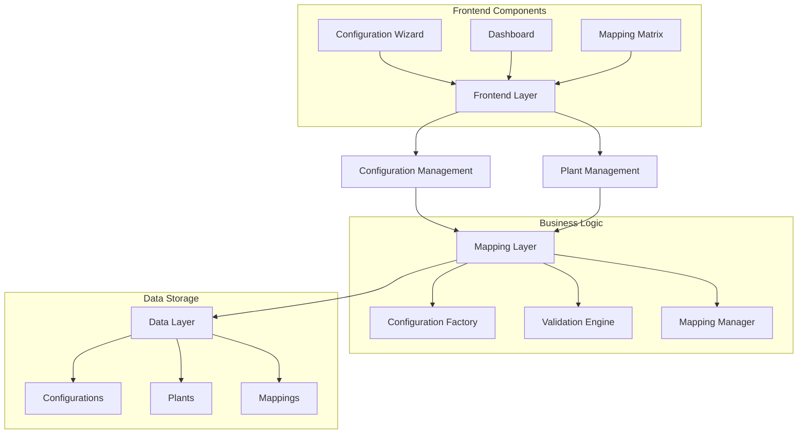

# Consolidated CER Configuration and Plant Management System

## 1. System Overview

### 1.1 Architecture


### 1.2 Core Features
- Dynamic configuration types (N configurations)
- Flexible plant management (M plants)
- Many-to-many relationship support
- Real-time validation
- Version control
- Audit trail

## 2. Data Models

### 2.1 Core Configuration Model
```typescript
interface CERConfiguration {
  id: string;
  name: string;
  type: string;
  version: string;
  status: 'draft' | 'active' | 'suspended';
  
  features: {
    [key: string]: any;
    maxMembers?: number;
    maxProductionUnits?: number;
    reportingFrequency?: string[];
    analytics?: string;
  };
  
  restrictions: {
    [key: string]: any;
    allowedLegalForms?: string[];
    maxCapacity?: number;
    documentStorage?: string;
  };
  
  community: CommunityConfig;
  technical: TechnicalConfig;
  economic: EconomicConfig;
  compliance: ComplianceConfig;
}

interface CommunityConfig {
  profile: CommunityProfile;
  legalForm: LegalEntityType;
  governance: GovernanceStructure;
}

interface TechnicalConfig {
  boundary: {
    cabinaId: string;
    coordinates: GeoCoordinates[];
    validationStatus: boolean;
  };
  productionUnits: ProductionUnit[];
  consumptionUnits: ConsumptionUnit[];
  connections: {
    pods: PODConnection[];
    validations: ConnectionValidation[];
  };
}
```

### 2.2 Plant Model
```typescript
interface Plant {
  id: string;
  type: string;
  capacity: number;
  location: GeoCoordinates;
  connection: {
    pod: string;
    validationStatus: boolean;
  };
  technical: PlantTechnicalDetails;
  operational: PlantOperationalStatus;
  compliance: PlantComplianceStatus;
}
```

### 2.3 Mapping Model
```typescript
interface ConfigurationPlantMapping {
  id: string;
  configurationId: string;
  plantIds: string[];
  status: 'active' | 'pending' | 'suspended';
  validations: ValidationResult[];
  createdAt: Date;
  updatedAt: Date;
}
```

## 3. Frontend Components

### 3.1 Configuration Management UI
```typescript
interface ConfigurationUI {
  components: {
    wizard: ConfigurationWizard;
    dashboard: DashboardModule;
    mapping: ConfigurationPlantManager;
  };
  
  features: {
    realTimeValidation: boolean;
    dragAndDrop: boolean;
    bulkOperations: boolean;
    versionControl: boolean;
  };
}

interface ConfigurationWizard {
  steps: {
    selectType: ConfigTypeSelector;
    basicInfo: BasicInfoForm;
    technical: TechnicalSetupForm;
    economic: EconomicSetupForm;
    compliance: ComplianceSetupForm;
    review: ConfigurationReview;
  };
  
  navigation: {
    progress: ProgressTracker;
    validation: StepValidator;
    actions: WizardActions;
  };
}

interface DashboardModule {
  components: {
    realTimeMetrics: EnergyMetricsPanel;
    kpiCharts: InteractiveChartGroup;
    alertNotifications: NotificationCenter;
    quickActions: ActionPanel;
  };
  
  features: {
    energyFlow: RealTimeFlowVisualization;
    performanceIndicators: KPIDisplay;
    complianceStatus: ComplianceMonitor;
  };
}
```

### 3.2 Plant Management UI
```typescript
interface PlantManagementUI {
  components: {
    list: PlantListView;
    detail: PlantDetailView;
    mapping: PlantMappingView;
  };
  
  features: {
    gisIntegration: GISModule;
    monitoring: MonitoringSystem;
    analytics: AnalyticsModule;
  };
}

interface GISModule {
  mapVisualization: {
    cabinaSubstation: SubstationBoundaryLayer;
    podConnections: PODLayer;
    productionUnits: ProductionUnitLayer;
    consumptionUnits: ConsumptionUnitLayer;
  };
  verificationTools: {
    areaSelection: InteractiveSelectionTool;
    podValidation: ValidationService;
    distanceCalculator: DistanceMetricTool;
    exportTools: DocumentExporter;
  };
}
```

### 3.3 Mapping Management UI
```typescript
interface MappingUI {
  components: {
    matrix: MappingMatrixView;
    validation: ValidationPanel;
    actions: MappingActions;
  };
  
  dnd: {
    onDragPlant: (plantId: string, targetConfigId: string) => Promise<void>;
    onDragConfiguration: (configId: string, targetPlantId: string) => Promise<void>;
  };
}
```

## 4. Business Logic Layer

### 4.1 Configuration Factory
```typescript
interface ConfigurationFactory {
  createConfiguration(type: ConfigurationType): CERConfiguration;
  upgradeConfiguration(config: CERConfiguration, newType: ConfigurationType): CERConfiguration;
  validateConfiguration(config: CERConfiguration): ValidationResult;
  
  templates: {
    getTemplate(type: ConfigurationType): ConfigTemplate;
    saveTemplate(template: ConfigTemplate): void;
    applyTemplate(config: CERConfiguration, template: ConfigTemplate): CERConfiguration;
  };
}
```

### 4.2 Mapping Manager
```typescript
interface MappingManager {
  // Core Operations
  addPlantToConfiguration(plantId: string, configId: string): Promise<void>;
  removePlantFromConfiguration(plantId: string, configId: string): Promise<void>;
  getConfigurationsForPlant(plantId: string): Promise<CERConfiguration[]>;
  getPlantsForConfiguration(configId: string): Promise<Plant[]>;
  
  // Validation
  validateMapping(plantId: string, configId: string): Promise<ValidationResult>;
  validateAllMappings(): Promise<ValidationResult[]>;
  
  // Bulk Operations
  bulkAddPlants(plantIds: string[], configId: string): Promise<void>;
  bulkAddConfigurations(configIds: string[], plantId: string): Promise<void>;
}
```

## 5. Implementation Strategy

### 5.1 Phase 1: Core System (Weeks 1-4)
1. **Data Layer Setup**
   - Database schema implementation
   - Migration scripts
   - Basic CRUD operations

2. **Business Logic Implementation**
   - Configuration factory
   - Mapping manager
   - Validation engine

3. **Basic UI Components**
   - Configuration wizard
   - Plant management
   - Simple mapping interface

### 5.2 Phase 2: Enhanced Features (Weeks 5-8)
1. **Advanced UI Features**
   - Interactive GIS integration
   - Real-time monitoring
   - Advanced mapping matrix

2. **Business Logic Enhancements**
   - Version control
   - Template system
   - Bulk operations

3. **Integration Features**
   - GSE/ARERA integration
   - External system connectors
   - API gateway setup

### 5.3 Phase 3: Optimization (Weeks 9-12)
1. **Performance Optimization**
   - Caching system
   - Query optimization
   - UI performance

2. **User Experience Enhancement**
   - Drag and drop refinement
   - Real-time validation
   - Error handling

3. **Documentation and Testing**
   - API documentation
   - User guides
   - E2E testing

## 6. Database Schema

```sql
-- Core Tables
CREATE TABLE configurations (
  id UUID PRIMARY KEY,
  name VARCHAR(255),
  type VARCHAR(50),
  version VARCHAR(50),
  status VARCHAR(50),
  features JSONB,
  restrictions JSONB,
  created_at TIMESTAMP,
  updated_at TIMESTAMP
);

CREATE TABLE plants (
  id UUID PRIMARY KEY,
  type VARCHAR(50),
  capacity DECIMAL,
  location JSONB,
  connection JSONB,
  technical JSONB,
  operational JSONB,
  compliance JSONB,
  created_at TIMESTAMP,
  updated_at TIMESTAMP
);

-- Mapping Table
CREATE TABLE configuration_plant_mappings (
  id UUID PRIMARY KEY,
  configuration_id UUID REFERENCES configurations(id),
  plant_id UUID REFERENCES plants(id),
  status VARCHAR(50),
  validations JSONB,
  created_at TIMESTAMP,
  updated_at TIMESTAMP,
  UNIQUE(configuration_id, plant_id)
);

-- Version Control
CREATE TABLE configuration_versions (
  id UUID PRIMARY KEY,
  configuration_id UUID REFERENCES configurations(id),
  version VARCHAR(50),
  changes JSONB,
  author VARCHAR(255),
  created_at TIMESTAMP
);
```

## 7. Testing Strategy

### 7.1 Unit Testing
- Component testing
- Service testing
- Validation logic testing

### 7.2 Integration Testing
- API endpoint testing
- Database operations
- External system integration

### 7.3 E2E Testing
- UI workflows
- Configuration lifecycle
- Plant management operations
- Mapping scenarios

## 8. Monitoring and Maintenance

### 8.1 Performance Monitoring
- Response time tracking
- Resource usage monitoring
- Error rate tracking

### 8.2 Regular Maintenance
- Database optimization
- Cache management
- Security updates

### 8.3 Backup Strategy
- Regular data backups
- Version history preservation
- Disaster recovery plan

## 9. Documentation

### 9.1 Technical Documentation
- API specifications
- Database schema
- Component documentation
- Integration guides

### 9.2 User Documentation
- User manuals
- Configuration guides
- Best practices
- Troubleshooting guides

# Consolidated CER Configuration System - Enhancement Plan

## 1. Current UI Analysis

### 1.1 Existing Components
```typescript
// Current UI Structure
interface ExistingCERUI {
  header: {
    breadcrumb: ['Home', 'Cer'];
    title: string;
    status: 'PENDING' | 'ACTIVE' | 'SUSPENDED';
    legalForm: 'Association' | 'Cooperative' | 'Corporation';
  };

  actions: {
    editCommunity: Button;
    complianceRecords: Button;
    energySharing: Button;
  };

  metrics: {
    totalCapacity: {
      current: number;
      max: number;
      unit: 'kW';
    };
    gseCompliance: {
      current: number;
      total: number;
    };
    members: {
      producers: number;
      consumers: number;
      prosumers: number;
    };
  };

  navigation: {
    members: Tab;
    boundary: Tab;
    documents: Tab;
    compliance: Tab;
    activity: Tab;
  };
}
```

### 1.2 Enhancement Areas
1. **Configuration Integration**
   - Add configuration type selection
   - Support multiple configurations per CER
   - Plant mapping interface
   - Enhanced compliance tracking

2. **UI Extensions**
   - Configuration management panel
   - Plant-to-configuration mapping view
   - Enhanced metrics for multiple configurations

## 2. Enhanced UI Components

### 2.1 Configuration Management Extension
```typescript
interface EnhancedCERUI extends ExistingCERUI {
  // New Configuration Panel
  configurationPanel: {
    activeConfig: ConfigurationSelector;
    configList: ConfigurationList;
    addConfig: Button;
    configActions: ConfigurationActions;
  };

  // Enhanced Metrics
  enhancedMetrics: {
    perConfiguration: {
      totalCapacity: MetricDisplay;
      gseCompliance: ComplianceDisplay;
      memberDistribution: MembershipDisplay;
    };
    aggregate: {
      totalCapacity: AggregateMetric;
      complianceStatus: ComplianceStatus;
      membershipSummary: MembershipSummary;
    };
  };

  // New Navigation Items
  extendedNavigation: {
    configurations: Tab;  // New tab for configuration management
    plantMapping: Tab;   // New tab for plant mapping
    ...existingTabs;
  };
}

interface ConfigurationSelector {
  currentConfig: CERConfiguration;
  onConfigChange: (configId: string) => void;
  status: ConfigurationStatus;
  actions: {
    edit: () => void;
    delete: () => void;
    duplicate: () => void;
  };
}

interface ConfigurationList {
  items: CERConfiguration[];
  view: 'grid' | 'list';
  filters: {
    status: string[];
    type: string[];
    capacity: Range;
  };
  sorting: {
    field: string;
    direction: 'asc' | 'desc';
  };
}
```

### 2.2 Plant Mapping Integration
```typescript
interface PlantMappingView {
  components: {
    plantList: {
      items: Plant[];
      selection: MultiSelect;
      filters: PlantFilters;
    };
    mappingMatrix: {
      configurations: CERConfiguration[];
      plants: Plant[];
      connections: PlantConfigMapping[];
    };
    actions: {
      addMapping: (plantId: string, configId: string) => void;
      removeMapping: (plantId: string, configId: string) => void;
      bulkMap: (plantIds: string[], configId: string) => void;
    };
  };
}
```

## 3. Implementation Plan

### 3.1 Phase 1: UI Enhancement (Weeks 1-3)
1. **Extend Existing UI**
   ```typescript
   // Add Configuration Management to Header
   interface EnhancedHeader extends ExistingHeader {
     configurationSelector: {
       current: ConfigurationDisplay;
       switcher: ConfigurationSwitcher;
     };
     configActions: {
       create: Button;
       manage: Button;
     };
   }

   // Enhance Metrics Panel
   interface EnhancedMetrics extends ExistingMetrics {
     perConfiguration: boolean;
     aggregateView: boolean;
     comparisonMode: boolean;
   }
   ```

2. **Add Configuration Management**
   - Configuration list view
   - Configuration details panel
   - Configuration wizard integration

3. **Update Navigation**
   - Add Configurations tab
   - Add Plant Mapping tab
   - Update existing tabs for configuration context

### 3.2 Phase 2: Data Integration (Weeks 4-6)
1. **Backend Integration**
   ```typescript
   interface ConfigurationService {
     // CRUD Operations
     getConfigurations(cerId: string): Promise<CERConfiguration[]>;
     createConfiguration(config: NewConfiguration): Promise<string>;
     updateConfiguration(config: UpdatedConfiguration): Promise<void>;
     deleteConfiguration(configId: string): Promise<void>;

     // Mapping Operations
     mapPlants(configId: string, plantIds: string[]): Promise<void>;
     unmapPlants(configId: string, plantIds: string[]): Promise<void>;
     getPlantMappings(configId: string): Promise<PlantMapping[]>;
   }
   ```

2. **State Management**
   ```typescript
   interface ConfigurationState {
     activeConfig: string | null;
     configurations: Map<string, CERConfiguration>;
     plantMappings: Map<string, PlantMapping[]>;
     loading: boolean;
     error: Error | null;
   }
   ```

### 3.3 Phase 3: Feature Enhancement (Weeks 7-9)
1. **Advanced Features**
   - Configuration comparison view
   - Bulk operations interface
   - Advanced filtering and sorting

2. **Validation and Compliance**
   - Real-time validation
   - Compliance tracking per configuration
   - Aggregated compliance reporting

## 4. UI Component Details

### 4.1 Configuration Management Panel
```typescript
interface ConfigurationPanel {
  layout: {
    position: 'sidebar' | 'modal' | 'embedded';
    size: 'compact' | 'full';
  };
  
  components: {
    header: {
      title: string;
      actions: ConfigurationActions;
    };
    
    content: {
      list: ConfigurationList;
      details: ConfigurationDetails;
      mapping: PlantMappingMatrix;
    };
    
    footer: {
      pagination: Pagination;
      summary: ConfigurationSummary;
    };
  };
}
```

### 4.2 Enhanced Metrics Display
```typescript
interface MetricsDisplay {
  mode: 'single' | 'comparison' | 'aggregate';
  
  components: {
    capacity: {
      current: number;
      target: number;
      progress: ProgressBar;
    };
    
    compliance: {
      status: ComplianceStatus;
      issues: ComplianceIssue[];
      progress: ComplianceProgress;
    };
    
    members: {
      distribution: MemberDistribution;
      trends: MemberTrends;
      actions: MemberActions;
    };
  };
}
```

## 5. Migration Strategy

### 5.1 Data Migration
```typescript
interface MigrationPlan {
  // Convert existing CER data to support multiple configurations
  steps: [
    {
      name: 'Create Default Configuration';
      action: () => Promise<void>;
    },
    {
      name: 'Map Existing Plants';
      action: () => Promise<void>;
    },
    {
      name: 'Update UI State';
      action: () => Promise<void>;
    }
  ];
}
```

### 5.2 UI Migration
1. **Phase 1: Add Configuration Support**
   - Add configuration selector to header
   - Implement basic configuration management
   - Update metrics display

2. **Phase 2: Enhance Existing Features**
   - Update member management for configurations
   - Enhance boundary management
   - Update compliance tracking

3. **Phase 3: Add New Features**
   - Implement plant mapping
   - Add configuration comparison
   - Enable bulk operations

## 6. Testing Plan

### 6.1 UI Testing
```typescript
interface UITestPlan {
  components: {
    configurationSelector: TestSuite;
    metricsDisplay: TestSuite;
    plantMapping: TestSuite;
  };
  
  interactions: {
    configurationSwitch: TestCase;
    plantMapping: TestCase;
    bulkOperations: TestCase;
  };
}
```

### 6.2 Integration Testing
- Configuration CRUD operations
- Plant mapping operations
- State management
- API integration

## 7. Documentation Updates

### 7.1 User Documentation
- Configuration management guide
- Plant mapping guide
- Migration guide for existing users

### 7.2 Technical Documentation
- API specifications
- Component documentation
- State management guide
- Migration scripts 