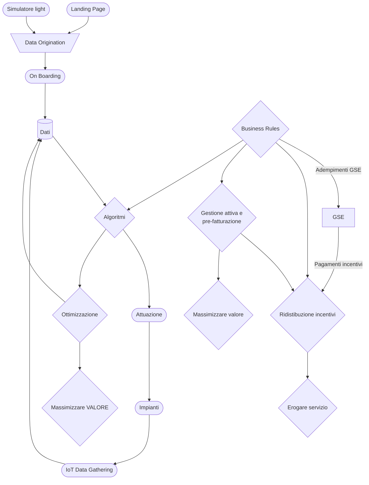
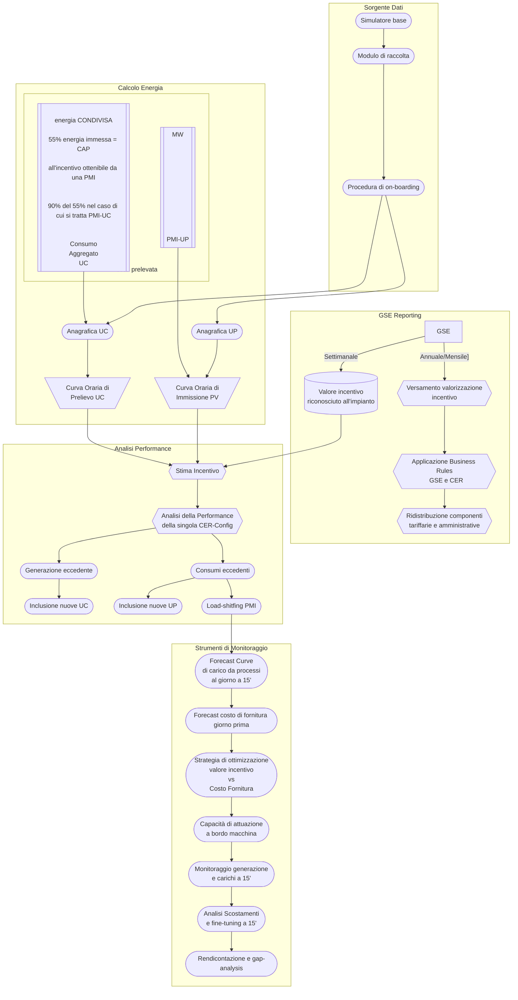

Below is the full, enhanced final document for the Energy Communities (CER) Module. This comprehensive Product Requirements Document (PRD) incorporates up‐to‐date regulatory information, technical details, and digital platform functionalities derived from recent research and industry best practices. The document is structured to cover the entire lifecycle of a CER project—from design through creation to daily operation—and includes details on system architecture, integration requirements, and digital tools that facilitate efficient management in line with the current Italian and European legislative frameworks.

> **Note:** This document builds on the latest updates regarding the Renewable Energy Directive (RED II), the Italian Decreto Milleproroghe (DL 162/2019 converted to Law n.8/2020), DLgs 199/2021, and recent updates such as the Decreto CER (DM n. 414/2023). It also integrates insights from recent studies on digital platforms for renewable energy communities (e.g., the GSE simulator, DHOMUS, RECON, FLEXO from Hive Power, and hierarchical EMS approaches) to ensure the platform is not only compliant but also state-of-the-art in terms of digital innovation. citeturn1search7, citeturn1academia17, citeturn1academia18

---

# Product Requirements Document: Energy Communities (CER) Module

## 1. Overview

The Energy Communities (CER) module is designed to manage Italy's renewable energy communities (Comunità Energetiche Rinnovabili – CER). These communities consist of citizens, small and medium enterprises (SMEs), local authorities, and other eligible organizations that collectively produce, share, and optimize renewable energy. The module's objectives are to enable efficient energy sharing, manage incentive distribution (including the tariff incentivante and ARERA contributions), and ensure full regulatory compliance with requirements established by the GSE, ARERA, and other national authorities.

Key goals include:
- **Maximizing self-consumption and shared energy:** Through both physical (direct) and virtual (metering-based) self-consumption.
- **Facilitating citizen participation:** Enabling even non-expert users to join and benefit from renewable energy generation.
- **Supporting regulatory reporting and incentive management:** In accordance with the latest Italian and EU guidelines.


## Flowchart




---

## 2. Regulatory and Conceptual Framework

### 2.1 European and National Legislation

CER configurations are established under the framework of the Renewable Energy Directive (RED II, 2018/2001) and the Internal Market for Electricity Directive (2019/944). Italy has transposed these directives through several measures:
- **Decreto Milleproroghe (DL 162/2019)** – the initial phase of transposition, later converted into Law n.8/2020.
- **Decreto Legislativo 199/2021** – which significantly increased the maximum allowable capacity for each renewable installation from 200 kW to 1 MW and extended the network eligibility from the secondary to the primary cabina.
- **Decreto CER (DM n. 414/2023)** – recently approved to detail the incentive mechanisms (tariffa incentivante and contributi in conto capitale) supporting CER development, including provisions tied to the PNRR for communities in municipalities with fewer than 5,000 inhabitants.

These legislative instruments mandate that all production and consumption units in a CER be geographically co‑locatable – typically connected to the same transformer station (cabina primaria) – ensuring minimal transmission losses and a uniform framework for virtual self‑consumption.

### 2.2 Key Definitions and Energy Flow Concepts

A CER is structured around the model of **autoconsumo diffuso (diffuse self‑consumption)**. Key definitions include:
- **Energia condivisa (Shared Energy):** The energy that is produced by renewable installations and "shared" among community members. It is calculated on an hourly basis as the minimum between the total renewable production and the aggregate consumption of all connected units.
- **Energia autoconsumata (Self‑Consumed Energy):** Energy that is consumed directly at the site of production (autoconsumo fisico) without entering the incentive scheme.
- **Energia incentivata (Incentivized Energy):** The portion of shared energy that qualifies for economic incentives, as determined by tariff rules established by ARERA and the Decreto CER.

---

## 3. System Architecture

### 3.1 Core Components

1. **Frontend Interface**  
   - **Landing Page & Promotional Content:**  
     Introduces CER benefits, regulatory updates, and explains the social, economic, and environmental value of joining a CER.  
   - **Interactive Simulators & Design Tools:**  
     – "Light" simulation tool to forecast energy savings and incentive potential.  
     – Integrated digital design tools for feasibility studies and energy modeling (drawing on methodologies from projects such as the ComER project).  
   - **Member Dashboard:**  
     – Personal data visualization for production, consumption, shared energy, and incentive accrual.  
     – Real-time analytics and forecasting modules (using LSTM-based prediction algorithms for short-term energy flows).  
   - **Administrator Console:**  
     – Tools for managing community configurations, member onboarding, compliance reporting, and interfacing with regulatory bodies.

2. **Data Management & Processing Layer**  
   - **Data Origination & Collection:**  
     – Integration with IoT sensors and smart meters (including support for smart home devices and digital meters, as per DHOMUS and similar tools).  
   - **Real-Time Monitoring & Analytics:**  
     – Collection of production, consumption, and sharing data with hourly resolution.  
     – Data processing pipelines for generating key performance indicators (KPIs) such as physical and virtual self-consumption indices.
   - **Energy Management System (EMS):**  
     – Hierarchical EMS architecture to optimize energy flows within the community.  
     – Advanced modules incorporating hybrid Fuzzy Inference Systems with Genetic Algorithms (FIS-GA) for cost minimization and decision support.  
     – Integration of Explainable AI (XAI) features to enhance transparency and human interpretability. citeturn1academia17

3. **Integration Layer**  
   - **External Interfaces:**  
     – **GSE Interface:** Automated data submissions to GSE portals ("Area Clienti") for incentive claims and regulatory reporting.  
     – **ARERA Compliance Module:** Ensures adherence to technical and economic criteria as defined by ARERA, including virtual metering and energy sharing calculations.  
   - **Financial and Payment Processing:**  
     – Integration with banking systems for disbursing incentives and processing payments (including support for PNRR-related capital grants).  
     – Dashboard for tracking revenue streams, cost savings, and economic performance (including NPV and payback period calculations).

4. **Digital Platform & Supporting Tools**  
   - **Project Lifecycle Support:**  
     The platform is organized around the three key phases of REC development:
     - **Design Phase:**  
       – Feasibility studies, simulation tools (e.g., PVsyst integration), and digital planning tools for estimating system performance and costs.  
       – Access to digital libraries of templates, best practices, and guidance documents.  
     - **Creation Phase:**  
       – Tools for formalizing the legal entity (including digital registration forms, e-signatures, and secure document repositories).  
       – Membership management systems that verify connection eligibility (e.g., ensuring all units are under the same "cabina primaria") using interactive mapping tools provided by GSE.  
     - **Operation Phase:**  
       – Real-time energy monitoring dashboards, fault/ticket management, asset performance analytics, and periodic compliance reporting.  
       – Integration of scheduling algorithms for demand response and coordination of distributed energy storage (e.g., similar to Hive Power's FLEXO platform).  
   - **Digital Tools Repository:**  
     – The platform incorporates a catalog of digital supporting tools, classified as commercial, EU-funded, or freeware (inspired by studies such as "Digital Platforms for Renewable Energy Communities Projects"). This repository is periodically updated to include new tools and integrations. citeturn1search12

---

## 4. Workflows

### 4.1 User Registration and Onboarding
1. **Access and Landing:**  
   – Visitors access the landing page, where they learn about CER benefits and regulatory incentives.
2. **Basic Registration:**  
   – Input personal details, membership type (Consumer, Producer, Prosumer) and verify geographic eligibility (via the interactive GSE cabina primaria map).  
3. **Membership Application:**  
   – Submit documentation for identity, connection point (POD) verification, and energy consumption/production profiles.  
4. **Community Selection/Creation:**  
   – Choose an existing CER or initiate a new community. For new CERs, the platform guides users through creating legal documents (statutes, bylaws) using pre-approved templates.
5. **Plant Registration (if applicable):**  
   – Register production units with technical details (capacity, location, meter IDs) ensuring compliance with legislative limits (up to 1 MW per plant for new installations).  
6. **Final Approval and Onboarding:**  
   – The administrator or designated "referente" reviews and approves the membership, after which the user gains access to the personalized dashboard.

### 4.2 Digital Support for CER Design, Creation, and Operation

#### **Design Phase:**
- **Feasibility and Simulation Tools:**  
  – Use integrated simulation tools (e.g., PVsyst modules, LSTM forecasts) to evaluate energy production and consumption patterns.  
  – Generate detailed feasibility reports with projected KPIs (physical self-consumption index, virtual self-consumption index, total self-consumption index, energy self-sufficiency index).  
- **Digital Template Library:**  
  – Access templates for legal documents, cost–benefit analysis forms, and best practices guidelines (incorporating insights from the ComER project and other EU-funded initiatives).

#### **Creation Phase:**
- **Legal and Administrative Workflow:**  
  – Step-by-step guided processes to formalize the CER as a legal entity, complete with e-signature support and automated document filing with relevant authorities.  
  – Tools for defining stakeholder roles, establishing governance models, and configuring system settings (e.g., distribution rules for incentives).
- **Financial Planning Module:**  
  – Integration of cost analysis tools (including CAPEX and OPEX estimation) and simulation of incentive scenarios (e.g., variable tariff incentives with regional adjustments).
  
#### **Operation Phase:**
- **Real-Time Energy Management:**  
  – Hierarchical EMS dashboards display real-time energy flows, shared energy metrics, and system alerts.  
  – Scheduling and optimization modules for demand response, load balancing, and coordinating energy storage systems.
- **Compliance and Reporting:**  
  – Automated generation of periodic compliance reports for submission to GSE and ARERA.  
  – Tools for tracking incentive accrual, analyzing performance trends, and performing sensitivity analyses.
- **User Engagement & Support:**  
  – Integrated ticketing systems, chatbots, and a "citizen energy desk" to assist members with technical and administrative queries.

### 4.3 Integration with External Systems
- **GSE and ARERA Interfaces:**  
  – APIs for automated data exchange with GSE's "Area Clienti" portal and ARERA's compliance systems.  
  – Real-time verification of energy data and seamless submission of regulatory reports.
- **Financial Systems Integration:**  
  – Connectivity with payment processors for disbursing incentive payments and managing PNRR capital grant transactions.
- **Third-Party System Integration:**  
  – Support for integration with ERP, CRM, and smart grid platforms (e.g., FLEXO by Hive Power) for enhanced operational efficiency.

---

## 5. Technical Specifications

### 5.1 Production and Consumption Units

#### **Production Units (UP)**
```typescript
interface ProductionUnit {
  id: string;
  type: 'PV' | 'WIND' | 'BIOGAS' | 'OTHER'; // Technologies based on renewable energy sources only
  capacity: number;       // in kW, maximum up to 1 MW per new installation
  location: GeoCoordinates; // Verified to be within the same cabina primaria for the REC
  status: 'active' | 'pending' | 'inactive';
  connectionPoint: string;  // POD identifier ensuring geographic eligibility
  meterId: string;
}
```

#### **Consumption Units (UC)**
```typescript
interface ConsumptionUnit {
  id: string;
  type: 'residential' | 'commercial' | 'industrial';
  annualConsumption: number; // in kWh, validated against consumption profiles
  profileType: string;       // load profile categorization (e.g., residential, office)
  connectionPoint: string;   // must be in the same distribution area (cabina primaria)
  meterId: string;
}
```

### 5.2 Energy Sharing Model & KPIs

#### **Core Parameters**
- **Measurement Intervals:**  
  – Energy production, consumption, and shared energy measured hourly.
- **Sharing Thresholds:**  
  – Minimum 55% energy input threshold for incentive eligibility; further adjustments (e.g., 90% of 55%) applied for specific member types.
- **Geographical Constraint:**  
  – All REC participants must have connection points under the same cabina primaria.

#### **Key Performance Indicators (KPIs)**
- **Physical Self-Consumption Index:**  
  Ratio of on-site (physical) energy consumption to total energy produced.
- **Virtual Self-Consumption Index:**  
  Ratio of energy "shared" (determined via virtual metering) among community members to total production.
- **Total Self-Consumption Index:**  
  Combined index that measures overall REC energy utilization.
- **Energy Self-Sufficiency Index:**  
  (Physical + Shared Energy) divided by total energy consumption.

These KPIs are critical for assessing REC performance and are dynamically updated on the platform dashboards.

### 5.3 Digital Platform Specifications

- **Scalability & Modularity:**  
  – Cloud-based microservices architecture ensuring scalability for increasing REC size and data volume.
- **Data Security & Compliance:**  
  – Adherence to GDPR and other national data protection regulations; secure data transmission between IoT devices and backend systems.
- **User Interface (UI):**  
  – Responsive, multilingual dashboards; role-based access controls for administrators, prosumers, and consumers.
- **Interoperability:**  
  – Open APIs for integration with external platforms (GSE, ARERA, ERP/CRM systems); support for industry-standard data formats.
- **Predictive Analytics:**  
  – Use of LSTM neural networks for energy forecasting; integration of fuzzy logic systems for decision support (FIS-GA).
- **Explainability:**  
  – Implementation of Explainable AI (XAI) features for transparency in algorithmic decisions regarding energy management and incentive calculations.

---

## 6. Digital Platform Functionalities

### 6.1 Support for REC Project Lifecycle

#### **Design Phase Tools:**
- **Feasibility and Simulation Modules:**  
  – Integrated simulation tools (e.g., PVsyst, LSTM forecasting) for predicting photovoltaic generation, consumption patterns, and shared energy metrics.
- **Digital Document Repository:**  
  – Template libraries for legal documents, cost–benefit analyses, and REC best practices.
- **Interactive Mapping:**  
  – Geographic Information System (GIS) integration to verify that all units fall under the same "cabina primaria" using GSE's interactive map.

#### **Creation Phase Tools:**
- **Legal Entity Setup:**  
  – Guided workflows for creating and registering the CER legal entity with e-signature support.
- **Stakeholder and Role Management:**  
  – Digital management of community members, enabling the assignment of roles (e.g., "referente") and automated eligibility checks.
- **Financial Planning & Incentive Simulation:**  
  – Modules that simulate CAPEX, OPEX, and incentive scenarios (tariff incentivante and ARERA contributions), offering sensitivity analyses based on varying energy prices.

#### **Operation Phase Tools:**
- **Real-Time Hierarchical Energy Management System (HEMS):**  
  – Online dashboard providing real-time monitoring of energy production, consumption, and sharing.  
  – Optimization of energy flows with decision algorithms (FIS-GA based) to maximize self-consumption and minimize grid dependency.  
  – Predictive maintenance and fault detection for production units and storage systems.
- **Compliance Reporting:**  
  – Automated generation and submission of periodic reports to GSE and ARERA, ensuring regulatory compliance.
- **Member Support Portal:**  
  – Ticketing system, chatbots, and technical help desks to support end-user queries.
- **Asset Aggregation and P2P Trading Support:**  
  – Tools for aggregating energy production from multiple prosumers and enabling peer-to-peer energy trading where applicable.

### 6.2 Integration of Digital Tools and Platforms

The platform's digital ecosystem will draw on both commercial and open-source/freeware tools:
- **Commercial Tools:**  
  – Integration with proprietary solutions like Hive Power's FLEXO for flexible asset management.
- **EU-Funded & Research Tools:**  
  – Incorporation of solutions developed under projects like the ComER project for REC management.
- **Freeware/Open-Source Tools:**  
  – Utilizing platforms such as GSE Simulator, DHOMUS, and RECON for energy modeling and simulation.  
  – Providing an API-based repository of digital tools categorized by project phase (design, creation, operation). citeturn1search12

---

## 7. Integration Requirements

- **API Integration:**  
  – The platform must interface seamlessly with GSE's "Area Clienti" and ARERA systems for real-time data exchange, compliance reporting, and incentive claim processing.
- **IoT Connectivity:**  
  – Support for numerous IoT devices and smart meters installed at each production and consumption unit.
- **Financial Systems:**  
  – Integration with payment gateways and financial management software to handle incentive disbursement and REC revenue accounting.
- **Interoperability with Third-Party Platforms:**  
  – Ensure compatibility with ERP, CRM, and digital twin systems that may be used by local authorities or private stakeholders.
- **Security & Compliance:**  
  – Adherence to GDPR, national cybersecurity standards, and industry best practices for data integrity and encryption.

---

## 8. Operational Features

### 8.1 Load Management and Optimization
- **Demand Response Scheduling:**  
  – Real-time control algorithms to optimize the timing of energy consumption based on production forecasts and market conditions.
- **Energy Storage Management:**  
  – Integration with energy storage systems (ESS) for load shifting and to maximize self-consumption.
- **Smart Appliance Integration:**  
  – Connectivity with home and building automation systems to adjust appliance operation based on REC conditions.

### 8.2 Member Engagement and Support
- **Community Dashboard:**  
  – Visualization of key performance metrics (KPIs) including self-consumption indexes, energy savings, and financial returns.
- **Interactive Communication Tools:**  
  – Forums, surveys, and feedback mechanisms to engage members in REC decision-making.
- **Educational Resources:**  
  – A knowledge base with webinars, tutorials, and best practice guides on REC participation and energy efficiency.

---

## 9. Implementation Timeline

### Phase 1: Foundation (0–6 months)
- **Infrastructure Setup:**  
  – Establish core cloud infrastructure, database architecture, and API endpoints.
- **Basic Registration and Onboarding:**  
  – Develop and deploy registration workflows and member dashboards.
- **Initial Data Integration:**  
  – Connect with IoT devices and initiate data collection channels.

### Phase 2: Integration (6–12 months)
- **External System Integration:**  
  – Establish API connectivity with GSE, ARERA, and financial systems.
- **Advanced Energy Management System (HEMS):**  
  – Deploy hierarchical EMS modules and integrate simulation and forecasting tools.
- **Digital Document and Workflow Tools:**  
  – Launch legal and financial planning modules for the creation phase.

### Phase 3: Enhancement (12–24 months)
- **Optimization and AI Modules:**  
  – Implement FIS-GA and LSTM modules for energy flow optimization.
- **User Engagement and Reporting Enhancements:**  
  – Refine dashboards, add reporting automation, and integrate user support features.
- **Scalability and Feature Expansion:**  
  – Expand functionality for additional REC types, multi-site management, and advanced analytics.
- **Feedback and Iteration:**  
  – Conduct pilot tests, gather user feedback, and refine the platform accordingly.

---

## 10. Success Metrics

### 10.1 Technical Performance
- **System Uptime:**  
  – 99.9% uptime target.
- **Response Time:**  
  – Sub-200 ms response time for data queries.
- **Data Accuracy:**  
  – Real-time data transmission with 99% accuracy.

### 10.2 Business and Community Objectives
- **Member Growth:**  
  – Increase in registered and active REC members.
- **Energy Sharing Efficiency:**  
  – Improvement in self-consumption indexes (target >80% overall).
- **Financial Outcomes:**  
  – Achievement of projected NPV, payback period, and IRR as per financial simulations.
- **Regulatory Compliance:**  
  – Timely and accurate reporting submissions to GSE and ARERA.

### 10.3 User Engagement
- **Member Satisfaction:**  
  – High satisfaction scores via periodic surveys.
- **Adoption of Digital Tools:**  
  – Engagement rates with simulation tools, dashboards, and support resources.

---

## 11. Appendices

### Appendix A – Digital Tools Repository
- **Commercial Platforms:**  
  – Example: Hive Power's FLEXO for flexible asset management.
- **EU-Funded Tools:**  
  – Examples include platforms developed in the ComER project.
- **Freeware/Open-Source Solutions:**  
  – GSE Simulator, DHOMUS, RECON.
- **Categorization:**  
  – Tools are cataloged by REC development phase: Design, Creation, Operation.
- **KPI Mapping:**  
  – Detailed mapping of each tool's functions to the corresponding REC KPIs.

### Appendix B – Regulatory Documents and Data Sources
- Links and summaries of key legislative texts (RED II, DL 162/2019, DLgs 199/2021, ARERA delibera 727/2022, TIAD).
- Data sources: GSE Atlaimpianti, official GSE and ARERA portals, and academic literature.

---

## 12. Conclusions and Future Directions

The proposed Energy Communities (CER) Module provides a robust, compliant, and technologically advanced platform that meets the challenges posed by Italy's evolving renewable energy regulatory framework. By integrating real-time data acquisition, advanced energy management algorithms, and comprehensive digital tools covering the full project lifecycle, the platform not only facilitates efficient REC management but also empowers citizens and local authorities to actively participate in the energy transition.

**Key benefits include:**
- Enhanced self-consumption and energy sharing through optimized hierarchical EMS.
- Streamlined compliance and regulatory reporting to meet GSE and ARERA requirements.
- Increased engagement and empowerment of community members via transparent digital dashboards and support tools.
- Scalable and modular architecture that can be adapted to future legislative changes and integrated with additional renewable technologies.

**Future enhancements may include:**
- Expansion of the platform to support additional renewable energy technologies (e.g., wind, biogas).
- Integration of storage and smart charging solutions to further optimize energy use.
- Advanced predictive analytics and machine learning models to enhance system responsiveness.
- Development of an open, dedicated registry for REC certification and continuous monitoring.

This comprehensive platform, backed by digital innovation and robust regulatory support, positions Italy to lead the deployment of renewable energy communities and serves as a replicable model for other municipalities across Europe.

---

## Author Contributions

- **Conceptualization:** [Your Team Names]
- **Methodology & Software:** [Your Team Names]
- **Validation & Analysis:** [Your Team Names]
- **Writing – Original Draft:** [Your Team Names]
- **Writing – Review & Editing:** [Your Team Names]
- **Visualization & Supervision:** [Your Team Names]

## Funding

This project is funded under [insert funding program details, e.g., European City Facility (EUCF) and PNRR funds] with additional support from [partner institutions].

## Acknowledgments

We acknowledge the contributions of the Municipality of Assisi, the Energy Center Lab of Politecnico di Torino, and other stakeholders who provided data and insights during the development of this platform.

## Conflicts of Interest

The authors declare no conflicts of interest.

## References

(Select key references from the list provided above and additional citations from the digital platform research.)
- citeturn1search7
- citeturn1academia17
- citeturn1academia18
- Additional references per internal citation style.

---

This final document offers a detailed roadmap for the development and deployment of a digital platform to manage renewable energy communities in Italy, ensuring compliance with current legislation, integration of advanced energy management technologies, and fostering an inclusive, efficient, and sustainable energy ecosystem.

## 4. Organizational and Legal Structure

### 4.1 Legal Form and Governance

CERs must be established as autonomous legal entities (e.g., associazioni non riconosciute, cooperative, società a responsabilità limitata, società benefit) with a primary social purpose of generating collective benefits rather than profit. The founding documents (atto costitutivo and statuto) must include:
- **Clear Objectives:** Prioritize environmental, social, and economic benefits.
- **Membership Rules:** Define who can participate. Eligible members include citizens, PMIs (provided that energy production is not their core business), local authorities, research institutions, and certain non-profit organizations. Large enterprises and companies in specific sectors (e.g., ATECO 35.11.00/35.14.00) are typically excluded from holding control.
- **Governance and Control:** The statute must ensure that decision-making power remains with eligible members and that participation is open and voluntary, with clear provisions for recesso (exit) and the equitable distribution of benefits.
- **Designation of a Referente:** A specific figure or entity is designated as responsible for interfacing with external bodies (e.g., the GSE) and for managing the internal administrative, technical, and financial operations of the CER.

### 4.2 Organizational Models and Examples

The literature and recent guides distinguish several models:
- **CER Industriali:** Groups of companies operating in the same industrial area, sharing surplus energy from on-site renewable installations.
- **CER Miste:** Mixed communities where citizens, enterprises, and local authorities join together.
- **CER in Partenariato Pubblico-Privato (PPP):** These leverage project financing and public support to deploy and manage larger installations.

## 5. Economic Incentives and Energy Valuation

### 5.1 Incentive Mechanisms

Recent legislative measures (e.g., Decreto CER, DM n. 414/2023) define the following incentive schemes:
- **Tariffa Incentivante (Incentive Tariff):**  
  A premium tariff is paid on the shared energy. The tariff is composed of a fixed part and a variable part (which decreases as the zonal price increases). Maximum values depend on the plant size:
  - ≤200 kW: up to 120 €/MWh,
  - >200 kW and ≤600 kW: up to 110 €/MWh,
  - >600 kW and ≤1 MW: up to 100 €/MWh.  
  Additional regional adjustments are applied (e.g., +4 €/MWh for Central Italy, +10 €/MWh for Northern Italy).
- **Contributi in Conto Capitale:**  
  For CERs in municipalities with fewer than 5,000 inhabitants, a grant of up to 40% of eligible costs is available under the PNRR, subject to thresholds on total renewable capacity (e.g., at least 2 GW installed and 2,500 GWh annual production).

### 5.2 Energy Performance Metrics

CER economic evaluation relies on performance indicators that include:
- **Indice di Autoconsumo Fisico:** The ratio of directly self-consumed energy at the production site.
- **Indice di Autoconsumo Virtuale:** The proportion of energy shared (via virtual metering) among community members.
- **Energia Condivisa, Autoconsumata, e Incentivata:** These metrics are computed hourly using data from all connected production and consumption units.
- **Valorizzazione dell'Autoconsumo:** Based on avoided grid costs and the tariffa incentivante, computed using formulas that include variable components (e.g., TRAS_E and BTAU) and adjustments for losses and market conditions.

## 13. References

- citeturn2search0 - European Directives and Italian Legislative Framework  
- citeturn2search1 - CER Technical Requirements and Operational Guidelines
- citeturn2search3 - Organizational Models for Energy Communities
- citeturn2search7 - Digital Platform Integration and Energy Management
- citeturn2search8 - Economic Incentives and Performance Metrics
- citeturn2search9 - Decreto CER Implementation Guidelines
- citeturn1search7 - Digital Tools for Energy Communities
- citeturn1search10 - Regulatory Compliance Requirements
- citeturn1search12 - Digital Platform Architecture
- citeturn1academia17 - Advanced Energy Management Systems
- citeturn1academia18 - AI and Machine Learning in Energy Communities

---

This integrated document offers a detailed roadmap for developing a digital platform to manage Renewable Energy Communities in Italy, synthesizing structural, technical, and regulatory aspects into a cohesive strategy aimed at fostering local energy self-sufficiency and supporting the country's broader energy transition goals.
